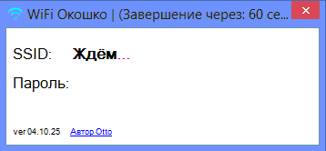
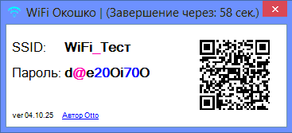

**WiFi Окошко** - Программа для считывания SSID и пароля WiFi c роутера Mikrotik'а по SSH, показывая эти данные в небольшом окошке на рабочем столе монитора с QR-кодом для подключения со смартфона.

Программа предназначена для простого просмотра SSID и пароля от WiFi, в тех случаях, когда требуется частая смена пароля (в автоматическом режиме для интерфейса 2,4ГГц) на роутере Mikrotik.

Используется _.NET Framework 4.8_

Версия языка C#: _13.0_

_Проект полностью открыт и распространяется по лицензии MIT._

Ссылки на [GitHub](https://github.com/Otto17/wifi_window) и [GitFlic](https://gitflic.ru/project/otto/wifi_window).

---

**В программе "**_**WiFi Окошко"**_**&#x20;можно:**

Выделить и скопировать как SSID, так и пароль, либо отсканировать QR код со смартфона для быстрого подключения к WiFi.

После запуска программа автоматически завершится после окончания таймера (1 минута), если её не закрыть вручную.

Буквы, цифры и спец. символы имеют разный окрас, для лёгкого визуального восприятия.

 

_"WiFi Окошко" только считывает SSID и пароль с роутера Mikrotik, ничего писать в него она не может._

---

**Порядок настройки:**

1. Если требуется атематическая смена SSID (опционально) и пароля на Mikrotik, тогда сначала нужно вставить скрипт в System → Script (назвать UpdateWi-Fi), настроить планировщик System → Scheduler (назвать UpdateWi-Fi с командой "/system script run UpdateWi-Fi"), включить локально SSH IP→ Services (желательно выбрать порт отличный от 22 и указать локальные IP в Available From, с которых будет доступ).

   _Рекомендую добавить нового пользователя в System → Users c правами "read" (только для чтения) для большей безопасности._

   Либо же использовать готовый скрипт из файла “configScript.rsc” (подправив разрешённые IP-адреса под вашу подсеть).

    

2. На компьютерах, где будет производиться запуск программы "_WiFi Окошко_" открыть скрипт "_Добавить пользователя в хранилище Win.bat_" в блокноте или Notepad++ и заменить -Username '**User:222**' -Password '**123456789**' на свой ('_User:222&#x20;_-**&#x20;**&#x441;начала указывается логин, затем порт SSH), сохранить и запустить от имени администратора.

    

3. Всё, можно запускать программу "_WiFi Окошко_".

---

**Автор Otto, г. Омск 2025**