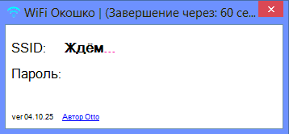
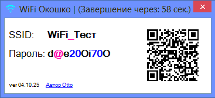

**WiFi Окошко** — Программа для считывания SSID и пароля WiFi c роутера Mikrotik через его api, показывая эти данные в небольшом окошке на рабочем столе монитора с QR-кодом для подключения со смартфона.

Программа предназначена для простого просмотра SSID и пароля от WiFi, в тех случаях, когда требуется частая смена пароля (в автоматическом режиме для интерфейса 2.4ГГц) на роутерах Mikrotik.

**WiFi Окошко (Virtual)** — Делает всё тоже самое, только считывание SSID и пароля WiFi происходит не из физического, а из виртуального интерфейса (независимо 2.4ГГц или 5ГГц) гостевой сети с изоляцией клиентов как между собой, так и в локальную сеть.

 

Версия языка C#: _13.0_

Используется _.NET Framework 4.8_

_Проект полностью открытый и бесплатный, распространяется по лицензии MIT._

Ссылки на [GitHub](https://github.com/Otto17/wifi_window) и [GitFlic](https://gitflic.ru/project/otto/wifi_window).




---

**В программе "**_**WiFi Окошко"**_**&#x20;можно:**

Выделить и скопировать как SSID, так и пароль, либо отсканировать QR код со смартфона для быстрого подключения к WiFi.

После запуска программа автоматически завершится после окончания таймера (1 минута), если её не закрыть вручную.

Буквы, цифры и спец. символы имеют разный окрас, для лёгкого визуального восприятия.

 

_"WiFi Окошко" только считывает SSID и пароль с роутера Mikrotik, ничего писать в него она не может!_

---

**Порядок настройки для WiFi Окошко:**

1. Если требуется автоматическая смена SSID (опционально) и пароля на Mikrotik, тогда сначала нужно вставить из файла "**Скрипт динамической смены пароля и SSID на Mikrotik.txt**" скрипт в System → Script (назвать **UpdateWi-Fi**), если требуется подправить в нём настройки, затем настроить планировщик System → Scheduler (назвать UpdateWi-Fi с командой "/system script run UpdateWi-Fi"), включить локально api, IP→ Services (желательно выбрать порт отличный от 8728 и указать локальные IP в Available From, с которых будет доступ).

   _Рекомендую добавить нового пользователя в System → Users c правами "read" (только для чтения) для большей безопасности!_

    

   Либо же использовать готовый скрипт из файла "**configScript.rsc**", предварительно открыв его в блокноте или Notepad++ и подправив в конце файла разрешённые IP-адреса (можно использовать сочетание клавиш **Ctrl+G** для быстрого перехода к нужной строке), через запятую под вашу подсеть к "/ip service" (_строка 197_) и "/user" (_строка 199_), в это же строке **изменить пароль пользователя "12345678"** на свой.

   Так же если требуется автоматическая смена SSID, то нужно перейти **на строку 23** и для переменной "_changeSsid_" изменить флаг с "false" на "true", затем сохранить конфиг, скопировать в Files (_на Mikrotik_) и импортировать.

    

2. На компьютерах, где будет производиться запуск программы "_WiFi Окошко_" открыть скрипт "**Добавить пользователя в хранилище Win.bat**" в блокноте или Notepad++ и заменить -Username '**User:222**' -Password '**12345678**' на свой (_User:222 —_**&#x20;**&#x441;начала указывается логин, затем порт api), сохранить и запустить от имени администратора.

    

3. Всё, можно запускать программу "_WiFi Окошко_".

---

**Порядок настройки для WiFi Окошко (Virtual):**

1. Если требуется автоматическая смена SSID (опционально) и пароля на Mikrotik, тогда сначала нужно вставить из файла "**Скрипт динамической смены пароля и SSID на виртуальном WiFi.txt**" скрипт в System → Script (назвать **UpdateVirtual\_Wi-Fi**), если требуется подправить в нём настройки, затем настроить планировщик System → Scheduler (назвать UpdateVirtual\_Wi-Fi с командой "/system script run UpdateVirtual\_Wi-Fi"), включить локально api, IP→ Services (желательно выбрать порт отличный от 8728 и указать локальные IP в Available From, с которых будет доступ).

    

   Затем создать второй скрипт в System → Script (назвать **Install\_Virtual\_Wi-Fi**), вставив в него скрипт из файла "**Скрипт создания виртуального WiFi.txt**", если требуется подправить в нём настройки, затем сохранить и запустить (_после выполнения он самоудалится_).

   _Рекомендую добавить нового пользователя в System → Users c правами "read" (только для чтения) для большей безопасности!_

    

   Либо же использовать готовый скрипт из файла "**InstallScript.rsc**", предварительно открыв его в блокноте или Notepad++ и подправив в конце файла разрешённые IP-адреса (можно использовать сочетание клавиш **Ctrl+G** для быстрого перехода к нужной строке), через запятую под вашу подсеть к "/ip service" (_строка 370_) и "/user" (_строка 372_), в это же строке **изменить пароль пользователя "12345678"** на свой.

   Так же если требуется автоматическая смена SSID, то нужно перейти **на строку 192** и для переменной "_changeSsid_" изменить флаг с "false" на "true". Ещё нужно перейти **на строку 9** и для переменной "_mainBridge_" заменить название основного бриджа на свой (_в моём случае он называется **lan**_).

   Если требуется виртуальный интерфейс на частоте 5ГГц, вместо 2.4ГГц, тогда нужно перейти **на строку 16** и для переменной "_targetBand_" изменить с "**2ghz**" на "**5ghz**", затем сохранить конфиг, скопировать в Files (_на Mikrotik_) и импортировать.

    

2. На компьютерах, где будет производиться запуск программы "_WiFi Окошко_" открыть скрипт "**Добавить пользователя в хранилище Win.bat**" в блокноте или Notepad++ и заменить -Username '**User:222**' -Password '**12345678**' на свой (_User:222 —_**&#x20;**&#x441;начала указывается логин, затем порт api), сохранить и запустить от имени администратора.

    

3. Всё, можно запускать программу "_WiFi Окошко_" (Virtual).

 

**Заметка:**

При импорте конфига "_InstallScript.rsc_" на RouterOS v7 можно получить вот такую ошибку:

```plaintext
[test@test] > import file=InstallScript.rsc
     :        Client_WLAN (master: wlan-2.4GHz,         : 2ghz)
Script Error: interrupted
interrupted
```

Эта ошибка вызвана поведением движка RouterOS v7 при самоудалении скрипта "_Install\_Virtual\_Wi-Fi_", после его выполнения, на самом деле тут ничего страшного, так, как скрипт удаляется, ещё не успев завершился, хотя фактически он уже отработал все команды и такое самоудаление никак не вредит.

---

**Автор Otto, г. Омск 2025-2026**